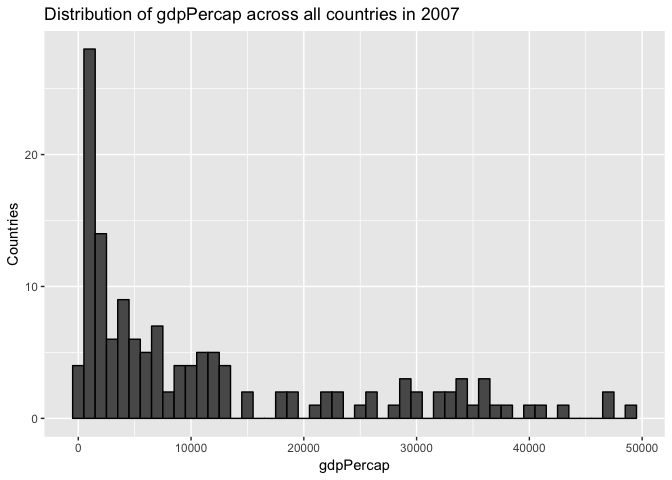
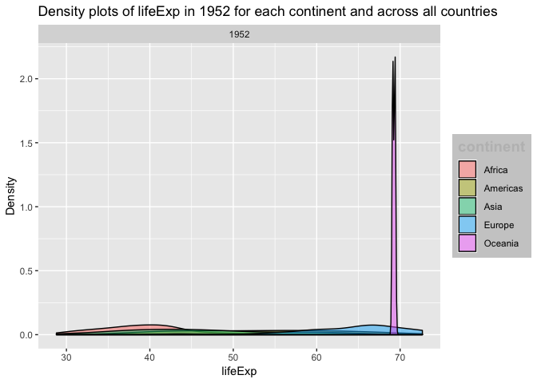
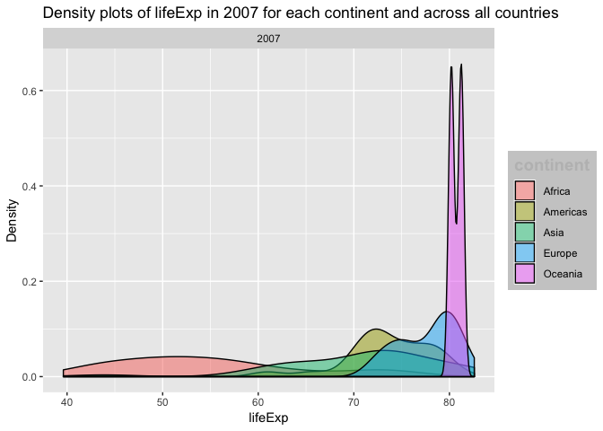
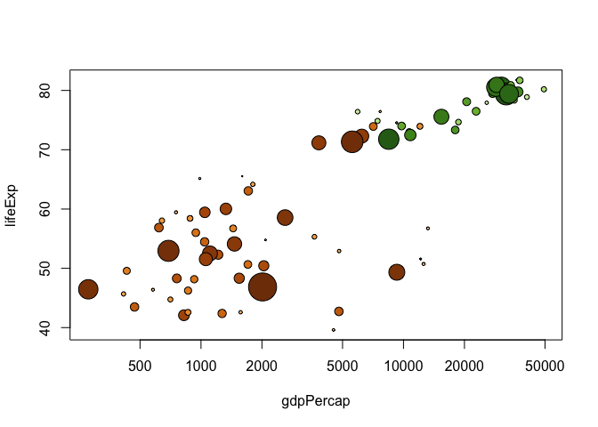
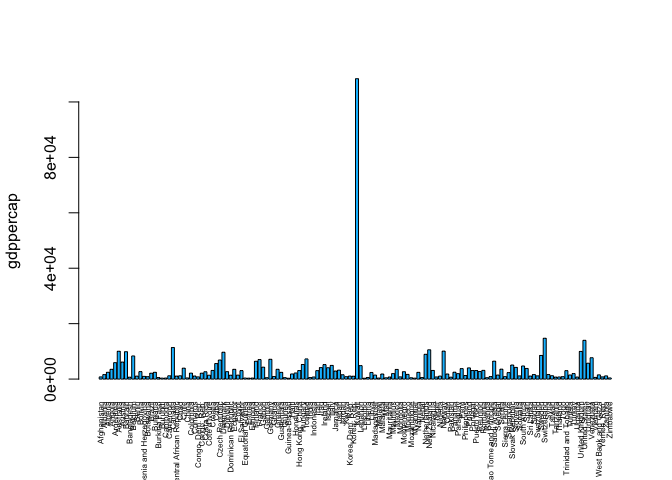
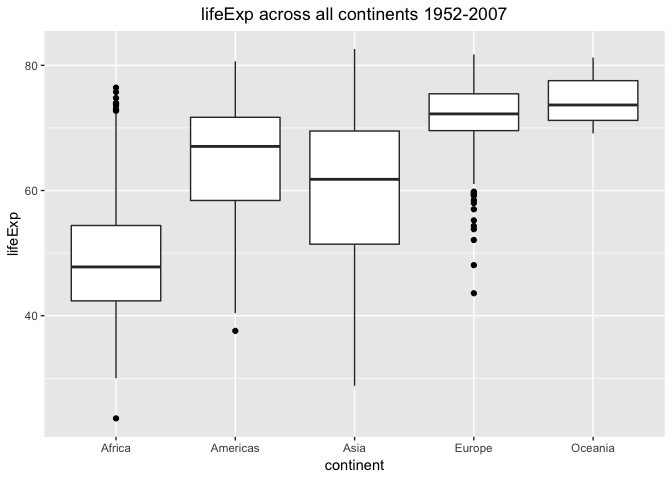

hw01\_gapminder.Rmd
================
Becky
2018-09-08

Data exploration using the gapminder data set
=============================================

### Required Libraries

``` r
library(gapminder)
require(plyr)
```

    ## Loading required package: plyr

``` r
library(dplyr)
```

    ## Warning: package 'dplyr' was built under R version 3.5.1

    ## 
    ## Attaching package: 'dplyr'

    ## The following objects are masked from 'package:plyr':
    ## 
    ##     arrange, count, desc, failwith, id, mutate, rename, summarise,
    ##     summarize

    ## The following objects are masked from 'package:stats':
    ## 
    ##     filter, lag

    ## The following objects are masked from 'package:base':
    ## 
    ##     intersect, setdiff, setequal, union

``` r
library(ggplot2)
library(gapminder)
gapminder ##calling entire gapminder dataset
```

    ## # A tibble: 1,704 x 6
    ##    country     continent  year lifeExp      pop gdpPercap
    ##    <fct>       <fct>     <int>   <dbl>    <int>     <dbl>
    ##  1 Afghanistan Asia       1952    28.8  8425333      779.
    ##  2 Afghanistan Asia       1957    30.3  9240934      821.
    ##  3 Afghanistan Asia       1962    32.0 10267083      853.
    ##  4 Afghanistan Asia       1967    34.0 11537966      836.
    ##  5 Afghanistan Asia       1972    36.1 13079460      740.
    ##  6 Afghanistan Asia       1977    38.4 14880372      786.
    ##  7 Afghanistan Asia       1982    39.9 12881816      978.
    ##  8 Afghanistan Asia       1987    40.8 13867957      852.
    ##  9 Afghanistan Asia       1992    41.7 16317921      649.
    ## 10 Afghanistan Asia       1997    41.8 22227415      635.
    ## # ... with 1,694 more rows

``` r
max(gapminder$year) 
```

    ## [1] 2007

``` r
min(gapminder$year)
```

    ## [1] 1952

### Dataset exploration and QC - Insepect and understand the dataset before use/ analysis - correct errors like removing NAs

``` r
head(gapminder)
```

    ## # A tibble: 6 x 6
    ##   country     continent  year lifeExp      pop gdpPercap
    ##   <fct>       <fct>     <int>   <dbl>    <int>     <dbl>
    ## 1 Afghanistan Asia       1952    28.8  8425333      779.
    ## 2 Afghanistan Asia       1957    30.3  9240934      821.
    ## 3 Afghanistan Asia       1962    32.0 10267083      853.
    ## 4 Afghanistan Asia       1967    34.0 11537966      836.
    ## 5 Afghanistan Asia       1972    36.1 13079460      740.
    ## 6 Afghanistan Asia       1977    38.4 14880372      786.

``` r
tail(gapminder)
```

    ## # A tibble: 6 x 6
    ##   country  continent  year lifeExp      pop gdpPercap
    ##   <fct>    <fct>     <int>   <dbl>    <int>     <dbl>
    ## 1 Zimbabwe Africa     1982    60.4  7636524      789.
    ## 2 Zimbabwe Africa     1987    62.4  9216418      706.
    ## 3 Zimbabwe Africa     1992    60.4 10704340      693.
    ## 4 Zimbabwe Africa     1997    46.8 11404948      792.
    ## 5 Zimbabwe Africa     2002    40.0 11926563      672.
    ## 6 Zimbabwe Africa     2007    43.5 12311143      470.

``` r
summary(gapminder)
```

    ##         country        continent        year         lifeExp     
    ##  Afghanistan:  12   Africa  :624   Min.   :1952   Min.   :23.60  
    ##  Albania    :  12   Americas:300   1st Qu.:1966   1st Qu.:48.20  
    ##  Algeria    :  12   Asia    :396   Median :1980   Median :60.71  
    ##  Angola     :  12   Europe  :360   Mean   :1980   Mean   :59.47  
    ##  Argentina  :  12   Oceania : 24   3rd Qu.:1993   3rd Qu.:70.85  
    ##  Australia  :  12                  Max.   :2007   Max.   :82.60  
    ##  (Other)    :1632                                                
    ##       pop              gdpPercap       
    ##  Min.   :6.001e+04   Min.   :   241.2  
    ##  1st Qu.:2.794e+06   1st Qu.:  1202.1  
    ##  Median :7.024e+06   Median :  3531.8  
    ##  Mean   :2.960e+07   Mean   :  7215.3  
    ##  3rd Qu.:1.959e+07   3rd Qu.:  9325.5  
    ##  Max.   :1.319e+09   Max.   :113523.1  
    ## 

``` r
dim(gapminder)
```

    ## [1] 1704    6

``` r
names(gapminder)
```

    ## [1] "country"   "continent" "year"      "lifeExp"   "pop"       "gdpPercap"

``` r
sum(is.na(gapminder$lifeExp))
```

    ## [1] 0

``` r
sum(is.na(gapminder$gdpPercap))
```

    ## [1] 0

``` r
sum(is.na(gapminder$pop))
```

    ## [1] 0

``` r
gapminder[!complete.cases(gapminder),] # view rows with incomplete data
```

    ## # A tibble: 0 x 6
    ## # ... with 6 variables: country <fct>, continent <fct>, year <int>,
    ## #   lifeExp <dbl>, pop <int>, gdpPercap <dbl>

``` r
gapminder %>% distinct(continent) %>% arrange(continent)
```

    ## # A tibble: 5 x 1
    ##   continent
    ##   <fct>    
    ## 1 Africa   
    ## 2 Americas 
    ## 3 Asia     
    ## 4 Europe   
    ## 5 Oceania

``` r
gapminder %>% distinct(country) %>% arrange(country)
```

    ## # A tibble: 142 x 1
    ##    country    
    ##    <fct>      
    ##  1 Afghanistan
    ##  2 Albania    
    ##  3 Algeria    
    ##  4 Angola     
    ##  5 Argentina  
    ##  6 Australia  
    ##  7 Austria    
    ##  8 Bahrain    
    ##  9 Bangladesh 
    ## 10 Belgium    
    ## # ... with 132 more rows

``` r
gapminder %>% distinct(year) %>% arrange(desc(year))
```

    ## # A tibble: 12 x 1
    ##     year
    ##    <int>
    ##  1  2007
    ##  2  2002
    ##  3  1997
    ##  4  1992
    ##  5  1987
    ##  6  1982
    ##  7  1977
    ##  8  1972
    ##  9  1967
    ## 10  1962
    ## 11  1957
    ## 12  1952

``` r
unique(gapminder$year)
```

    ##  [1] 1952 1957 1962 1967 1972 1977 1982 1987 1992 1997 2002 2007

``` r
#is.na(gapminder)
#gapm <- na.omit(gapminder)
```

### Distribution of gdpPercap across all countries in 2007

``` r
gapminder %>%
  filter(year==2007) %>%
  ggplot() + 
  geom_histogram(mapping = aes(x = gdpPercap), binwidth = 1000, color = "black") +
  ggtitle("Distribution of gdpPercap across all countries in 2007") +
  labs(x="gdpPercap", y="Countries")
```



### Density plots of life expectancy by continent

#### Oldest year 1952

``` r
lifexp_1952<- gapminder %>% 
 filter(year == 1952) 
lifexp_1952 %>%
 ggplot(aes(x = lifeExp, fill = continent)) + facet_wrap(~year) + geom_density(alpha = 0.5) + ggtitle("Density plots of lifeExp in 1952 for each continent and across all countries") + theme(legend.title = element_text(color = "gray", size = 14, face = "bold"), legend.background = element_rect(fill = "gray80",
 size = 0.2,
 linetype = "dashed")) +
 labs(x="lifeExp", y="Density")
```

 \#\#\#\# Latest year 2007

``` r
lifeExp_2007<- gapminder %>% 
 filter(year == 2007) 
lifeExp_2007 %>%
 ggplot(aes(x = lifeExp, fill = continent)) + facet_wrap(~year) + 
 geom_density(alpha = 0.5) +
 ggtitle("Density plots of lifeExp in 2007 for each continent and across all countries") +
 theme(legend.title = element_text(color = "gray",
 size = 14,
 face = "bold"),
 legend.background = element_rect(fill = "gray80",
 size = 0.5,
 linetype = "dashed")) +
 labs(x="lifeExp", y="Density")
```



### Awesome Bubble plot from Jenny's [tutorial on gapminder](https://cran.r-project.org/web/packages/gapminder/README.html)

``` r
gap_with_colors <-
  data.frame(gapminder,
             cc = I(country_colors[match(gapminder$country,
                                         names(country_colors))]))

# bubble plot, focus just on Africa and Europe in 2007
keepers <- with(gap_with_colors,
                continent %in% c("Africa", "Europe") & year == 2007)
plot(lifeExp ~ gdpPercap, gap_with_colors,
     subset = keepers, log = "x", pch = 21,
     cex = sqrt(gap_with_colors$pop[keepers]/pi)/1500,
     bg = gap_with_colors$cc[keepers])
```



### Life Expectancy across all countries

``` r
ggplot(aes(x = continent, y = lifeExp), data =gapminder) +
geom_boxplot(fill = "slategray1") +
ggtitle("lifeExp across all continents 1952-2007")+theme(plot.title = element_text(hjust = 0.5))
```



``` r
library("ggplot2")
ggplot(gapminder, aes(x = continent, y = lifeExp)) +
geom_boxplot(outlier.colour = "black") +
ggtitle("lifeExp across all continents 1952-2007")+theme(plot.title = element_text(hjust = 0.5))
```


