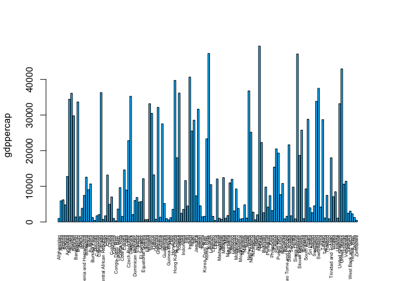
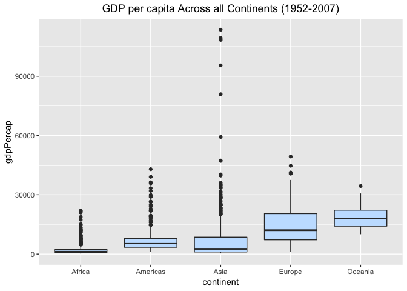

hw01\_gapminder.Rmd
================
Rebecca Asiimwe
2018-09-08

Data exploration using the gapminder data set
=============================================

-   [1 Preliminary requirements for data exploration](#preliminary-requirements-for-data-exploration)
-   [1.1 Loading required packages](#loading-required-packages)
-   [1.2 Loading exploration dataset](#loading-exploration-dataset)
-   [2 Dataset Inspection and QC](#dataset-inspection-and-qc)
-   [2.1 Inspecting the dataset](#inspecting-the-dataset)
-   [2.2 Quality Control](#quality-control)
-   [3 Data exploration](#data-exploration)
-   [3.1 Distribution of GDP Per Capita across all countries in 2007](#distribution-of-gdp-per-capita-across-all-countries-in-2007)
-   [3.2 Distribution of GDP Per Capita across all countries in 1952](#distribution-of-gdp-per-capita-across-all-countries-in-1952)
-   [3.3 Population distribution across all countries in 2007](#population-distribution-across-all-countries-in-2007)
-   [3.4 Population distribution across all countries in 1952](#population-distribution-across-all-countries-in-1952)
-   [3.5 Sanity check on population across entire dataset](#sanity-check-on-population-across-entire-dataset)
-   [3.5.1 Identifying outliers](#identifying-outliers)
-   [3.6 Distribution of life expectancy across all countries in 2007](#distribution-of-life-expectancy-across-all-countries-in-2007)
-   [3.7 Distribution of life expectancy across all countries in 1952](#distribution-of-life-expectancy-across-all-countries-in-1952)
-   [3.8 Density plots of GDP per capita by continent](#density-plots-of-gdp-per-capita-by-continent)
-   [3.8.1 In the year 1952](#in-the-year-1952)
-   [3.8.2 In the year 2007](#in-the-year-2007)
-   [3.9 Density plots of life expectancy by continent](#density-plots-of-life-expectancy-by-continent)
-   [3.9.1 In the year 1952](#in-the-year-1952)
-   [3.9.2 In the year 2007](#in-the-year-2007)
-   [3.10 Correlation between GDP per capita and life expectancy](#correlation-between-gdp-per-capita-and-life-expectancy)
-   [3.10.1 In Canada](#in-canada)
-   [3.10.2 Overall](#overall)
-   [3.11 Continental representation of GDP per capita Vs life expectancy](#continental-representation-of-gdp-per-capita-vs-life-expectancy)
-   [3.12 Continental representation of GDP per capita Vs life expectancy in 1952 and 2007](#continental-representation-of-gdp-per-capita-vs-life-expectancy)
-   [3.13 Sanity check of GDP per capita Vs life expectancy of all continents](#sanity-check-of-gdp-per-capita-vs-life-expectancy-of-all-continents)
-   [3.14 Sanity check comparing GDP per capita across all continents](#sanity-check-comparing-gdp-per-capita-across-all-continents)
-   [3.15 Sanity check comparing life expectancy across all continents](#sanity-check-comparing-life%20expectancy-across-all-continents)

### 1. Preliminary requirements for data exploration

#### 1.1 Loading required packages

``` r
library(gapminder)
require(plyr)
library(dplyr)
```

    ## Warning: package 'dplyr' was built under R version 3.5.1

``` r
library(ggplot2)
library(lattice)
```

#### 1.2 Loading exploration dataset

``` r
library(gapminder) 
dataset <- gapminder #renaming to preferred name
```

### 2 Dataset Inspection and QC

#### 2.1 Inspecting the dataset

``` r
# 1. Checking data set type. Is it a dataframe? Is it a matrix? List? ...
class (dataset) 
```

    ## [1] "tbl_df"     "tbl"        "data.frame"

``` r
# 2. Viewing top rows
head(dataset, n=7) # in this case I have specified number of rows to view (7 rows)
```

    ## # A tibble: 7 x 6
    ##   country     continent  year lifeExp      pop gdpPercap
    ##   <fct>       <fct>     <int>   <dbl>    <int>     <dbl>
    ## 1 Afghanistan Asia       1952    28.8  8425333      779.
    ## 2 Afghanistan Asia       1957    30.3  9240934      821.
    ## 3 Afghanistan Asia       1962    32.0 10267083      853.
    ## 4 Afghanistan Asia       1967    34.0 11537966      836.
    ## 5 Afghanistan Asia       1972    36.1 13079460      740.
    ## 6 Afghanistan Asia       1977    38.4 14880372      786.
    ## 7 Afghanistan Asia       1982    39.9 12881816      978.

``` r
# 3. Viewing bottom rows of dataframe
tail(dataset) 
```

    ## # A tibble: 6 x 6
    ##   country  continent  year lifeExp      pop gdpPercap
    ##   <fct>    <fct>     <int>   <dbl>    <int>     <dbl>
    ## 1 Zimbabwe Africa     1982    60.4  7636524      789.
    ## 2 Zimbabwe Africa     1987    62.4  9216418      706.
    ## 3 Zimbabwe Africa     1992    60.4 10704340      693.
    ## 4 Zimbabwe Africa     1997    46.8 11404948      792.
    ## 5 Zimbabwe Africa     2002    40.0 11926563      672.
    ## 6 Zimbabwe Africa     2007    43.5 12311143      470.

``` r
# 4. Extracting summary view of data
summary(dataset)
```

    ##         country        continent        year         lifeExp     
    ##  Afghanistan:  12   Africa  :624   Min.   :1952   Min.   :23.60  
    ##  Albania    :  12   Americas:300   1st Qu.:1966   1st Qu.:48.20  
    ##  Algeria    :  12   Asia    :396   Median :1980   Median :60.71  
    ##  Angola     :  12   Europe  :360   Mean   :1980   Mean   :59.47  
    ##  Argentina  :  12   Oceania : 24   3rd Qu.:1993   3rd Qu.:70.85  
    ##  Australia  :  12                  Max.   :2007   Max.   :82.60  
    ##  (Other)    :1632                                                
    ##       pop              gdpPercap       
    ##  Min.   :6.001e+04   Min.   :   241.2  
    ##  1st Qu.:2.794e+06   1st Qu.:  1202.1  
    ##  Median :7.024e+06   Median :  3531.8  
    ##  Mean   :2.960e+07   Mean   :  7215.3  
    ##  3rd Qu.:1.959e+07   3rd Qu.:  9325.5  
    ##  Max.   :1.319e+09   Max.   :113523.1  
    ## 

``` r
# 5. Viewing structure of the data set using the "str" function
str(dataset)
```

    ## Classes 'tbl_df', 'tbl' and 'data.frame':    1704 obs. of  6 variables:
    ##  $ country  : Factor w/ 142 levels "Afghanistan",..: 1 1 1 1 1 1 1 1 1 1 ...
    ##  $ continent: Factor w/ 5 levels "Africa","Americas",..: 3 3 3 3 3 3 3 3 3 3 ...
    ##  $ year     : int  1952 1957 1962 1967 1972 1977 1982 1987 1992 1997 ...
    ##  $ lifeExp  : num  28.8 30.3 32 34 36.1 ...
    ##  $ pop      : int  8425333 9240934 10267083 11537966 13079460 14880372 12881816 13867957 16317921 22227415 ...
    ##  $ gdpPercap: num  779 821 853 836 740 ...

``` r
# 6. Checking ther dimensions of the dataframe (nrows x ncols)
dim(dataset) # in this example, the dataset has 1704 rows and 6 columns (1704 x 6)
```

    ## [1] 1704    6

``` r
nrow(dataset) # also used to retrieve number of rows
```

    ## [1] 1704

``` r
ncol(dataset) # also used to retrieve number of columns
```

    ## [1] 6

``` r
# 7. Extracting column names
names(dataset) 
```

    ## [1] "country"   "continent" "year"      "lifeExp"   "pop"       "gdpPercap"

``` r
## ----------------------------------------------------------------------------------------
# More data exploration
## ----------------------------------------------------------------------------------------

# 8. Highest value for variable/ column year
max(dataset$year) 
```

    ## [1] 2007

``` r
# 9. Minimum value in the column, year
min(dataset$year) 
```

    ## [1] 1952

``` r
# 10. Since data sets have repeated values, we may be interested in seeing unique values of a variable. 
# 10.1 View unique values of a column in asc. or desc. order
dataset %>% distinct(continent) %>% arrange(continent) 
```

    ## # A tibble: 5 x 1
    ##   continent
    ##   <fct>    
    ## 1 Africa   
    ## 2 Americas 
    ## 3 Asia     
    ## 4 Europe   
    ## 5 Oceania

``` r
dataset %>% distinct(country) %>% arrange(country)
```

    ## # A tibble: 142 x 1
    ##    country    
    ##    <fct>      
    ##  1 Afghanistan
    ##  2 Albania    
    ##  3 Algeria    
    ##  4 Angola     
    ##  5 Argentina  
    ##  6 Australia  
    ##  7 Austria    
    ##  8 Bahrain    
    ##  9 Bangladesh 
    ## 10 Belgium    
    ## # ... with 132 more rows

``` r
dataset %>% distinct(year) %>% arrange(desc(year))
```

    ## # A tibble: 12 x 1
    ##     year
    ##    <int>
    ##  1  2007
    ##  2  2002
    ##  3  1997
    ##  4  1992
    ##  5  1987
    ##  6  1982
    ##  7  1977
    ##  8  1972
    ##  9  1967
    ## 10  1962
    ## 11  1957
    ## 12  1952

``` r
# 10.2 Alternative way of extracting unique values
unique(dataset$country)
```

    ##   [1] Afghanistan              Albania                 
    ##   [3] Algeria                  Angola                  
    ##   [5] Argentina                Australia               
    ##   [7] Austria                  Bahrain                 
    ##   [9] Bangladesh               Belgium                 
    ##  [11] Benin                    Bolivia                 
    ##  [13] Bosnia and Herzegovina   Botswana                
    ##  [15] Brazil                   Bulgaria                
    ##  [17] Burkina Faso             Burundi                 
    ##  [19] Cambodia                 Cameroon                
    ##  [21] Canada                   Central African Republic
    ##  [23] Chad                     Chile                   
    ##  [25] China                    Colombia                
    ##  [27] Comoros                  Congo, Dem. Rep.        
    ##  [29] Congo, Rep.              Costa Rica              
    ##  [31] Cote d'Ivoire            Croatia                 
    ##  [33] Cuba                     Czech Republic          
    ##  [35] Denmark                  Djibouti                
    ##  [37] Dominican Republic       Ecuador                 
    ##  [39] Egypt                    El Salvador             
    ##  [41] Equatorial Guinea        Eritrea                 
    ##  [43] Ethiopia                 Finland                 
    ##  [45] France                   Gabon                   
    ##  [47] Gambia                   Germany                 
    ##  [49] Ghana                    Greece                  
    ##  [51] Guatemala                Guinea                  
    ##  [53] Guinea-Bissau            Haiti                   
    ##  [55] Honduras                 Hong Kong, China        
    ##  [57] Hungary                  Iceland                 
    ##  [59] India                    Indonesia               
    ##  [61] Iran                     Iraq                    
    ##  [63] Ireland                  Israel                  
    ##  [65] Italy                    Jamaica                 
    ##  [67] Japan                    Jordan                  
    ##  [69] Kenya                    Korea, Dem. Rep.        
    ##  [71] Korea, Rep.              Kuwait                  
    ##  [73] Lebanon                  Lesotho                 
    ##  [75] Liberia                  Libya                   
    ##  [77] Madagascar               Malawi                  
    ##  [79] Malaysia                 Mali                    
    ##  [81] Mauritania               Mauritius               
    ##  [83] Mexico                   Mongolia                
    ##  [85] Montenegro               Morocco                 
    ##  [87] Mozambique               Myanmar                 
    ##  [89] Namibia                  Nepal                   
    ##  [91] Netherlands              New Zealand             
    ##  [93] Nicaragua                Niger                   
    ##  [95] Nigeria                  Norway                  
    ##  [97] Oman                     Pakistan                
    ##  [99] Panama                   Paraguay                
    ## [101] Peru                     Philippines             
    ## [103] Poland                   Portugal                
    ## [105] Puerto Rico              Reunion                 
    ## [107] Romania                  Rwanda                  
    ## [109] Sao Tome and Principe    Saudi Arabia            
    ## [111] Senegal                  Serbia                  
    ## [113] Sierra Leone             Singapore               
    ## [115] Slovak Republic          Slovenia                
    ## [117] Somalia                  South Africa            
    ## [119] Spain                    Sri Lanka               
    ## [121] Sudan                    Swaziland               
    ## [123] Sweden                   Switzerland             
    ## [125] Syria                    Taiwan                  
    ## [127] Tanzania                 Thailand                
    ## [129] Togo                     Trinidad and Tobago     
    ## [131] Tunisia                  Turkey                  
    ## [133] Uganda                   United Kingdom          
    ## [135] United States            Uruguay                 
    ## [137] Venezuela                Vietnam                 
    ## [139] West Bank and Gaza       Yemen, Rep.             
    ## [141] Zambia                   Zimbabwe                
    ## 142 Levels: Afghanistan Albania Algeria Angola Argentina ... Zimbabwe

``` r
unique(dataset$year)
```

    ##  [1] 1952 1957 1962 1967 1972 1977 1982 1987 1992 1997 2002 2007

``` r
unique(dataset$continent)
```

    ## [1] Asia     Europe   Africa   Americas Oceania 
    ## Levels: Africa Americas Asia Europe Oceania

#### 2.2 Quality Control

Quality Control (QC) involves checking for errors and missing data that could hinder preliminary visual data exploration and future data analysis (e.g. removing rows with missing data - NAs)

``` r
# 1. is.na(dataset)
#-------------------------------
# the above command echos TRUE for every cell with missing data. The output of this command is and can be too long depending on the number or rows in a dataset - may not be very helpful. It is better to look into other options to get a similar result instead of looking through hundreds or thousands of rows

# 2. To omit rows with missing data:
na.omit(dataset) 
```

    ## # A tibble: 1,704 x 6
    ##    country     continent  year lifeExp      pop gdpPercap
    ##    <fct>       <fct>     <int>   <dbl>    <int>     <dbl>
    ##  1 Afghanistan Asia       1952    28.8  8425333      779.
    ##  2 Afghanistan Asia       1957    30.3  9240934      821.
    ##  3 Afghanistan Asia       1962    32.0 10267083      853.
    ##  4 Afghanistan Asia       1967    34.0 11537966      836.
    ##  5 Afghanistan Asia       1972    36.1 13079460      740.
    ##  6 Afghanistan Asia       1977    38.4 14880372      786.
    ##  7 Afghanistan Asia       1982    39.9 12881816      978.
    ##  8 Afghanistan Asia       1987    40.8 13867957      852.
    ##  9 Afghanistan Asia       1992    41.7 16317921      649.
    ## 10 Afghanistan Asia       1997    41.8 22227415      635.
    ## # ... with 1,694 more rows

``` r
# 3. Summation of missing data in columns, 0 --> no missing data
sum(is.na(dataset$lifeExp)) 
```

    ## [1] 0

``` r
sum(is.na(dataset$gdpPercap)) 
```

    ## [1] 0

``` r
sum(is.na(dataset$pop)) 
```

    ## [1] 0

``` r
# View rows with incomplete data
dataset[!complete.cases(dataset),] 
```

    ## # A tibble: 0 x 6
    ## # ... with 6 variables: country <fct>, continent <fct>, year <int>,
    ## #   lifeExp <dbl>, pop <int>, gdpPercap <dbl>

### 3 Data exploration

A further look into the dataset using visual exploration: Given the nature of this data set, I explored a few sections of it. My first question was: What is the distribution of gdp per capita in 1952 (the oldest year) vs 2007 (the most current year in our data set)?

#### 3.1 Distribution of GDP Per Capita across all countries in 2007

``` r
# filtering data for 2007 entries 
set_2007 <- dataset %>% filter(year==2007)
max(set_2007$gdpPercap)
```

    ## [1] 49357.19

``` r
min(set_2007$gdpPercap)
```

    ## [1] 277.5519

``` r
var(set_2007$gdpPercap)
```

    ## [1] 165377988

``` r
sum(gapminder$pop)
```

    ## [1] 50440465801

``` r
barplot(set_2007$gdpPercap, ylab="gdppercap", names.arg =set_2007$country,border ='black',las=3,xpd = TRUE, axes = TRUE, axisnames = TRUE, cex.axis=1, cex.names=0.5,col="deepskyblue")
```



As we can see, there is a variable distribution of gdp per capita across all countries in 2007, with some countries having a very high gdp per capita compated to other countries. Also to note is that, the x axis is taking on so many names when we run:

``` r
nrow(set_2007)#$country)
```

    ## [1] 142

We can see that the number of countries are 142. Methods to make the plot using the "space" and "width" parameters were not helpful. However, we can still get an overview of the distribution of gdp per capita across ther countries. Of interest would to subset the data further and look into specifi scenarios.

#### 3.2 Distribution of GDP Per Capita across all countries in 1952

``` r
# filtering data for 1952 entries 
set_1952 <- dataset %>% filter(year==1952)
barplot(set_1952$gdpPercap, ylab="gdppercap", names.arg =set_1952$country,border ='black',las=3,xpd = TRUE, axes = TRUE, axisnames = TRUE, cex.axis=1, cex.names=0.5,col="deepskyblue")
```


From the above plot, we can see that there is an outlier that can heavily skew the data set. A futher look into the maximum, minimum and average gdp per capita in both 2007 and 1952:

``` r
# 2007
max(set_2007$gdpPercap) #49,357.19
```

    ## [1] 49357.19

``` r
min(set_2007$gdpPercap) #277.5519
```

    ## [1] 277.5519

``` r
mean(set_2007$gdpPercap) #11,680.07
```

    ## [1] 11680.07

``` r
#1952
max(set_1952$gdpPercap) #108,382.4 -108382.35
```

    ## [1] 108382.4

``` r
min(set_1952$gdpPercap) #298.8462
```

    ## [1] 298.8462

``` r
mean(set_1952$gdpPercap) #3,725.276
```

    ## [1] 3725.276

As we can see, from the code snippet above, the gdp in 2007 is much higher than that in 1952 regardless of the outlier we seen in the 1952 data set.

#### 3.3 Population distribution across all countries in 2007

``` r
barplot(set_2007$pop, ylab="population", names.arg =set_2007$country,border ='black',las=3,xpd = TRUE, axes = TRUE, axisnames = TRUE, cex.axis=1, cex.names=0.5, ylim = c(min(set_2007$pop)-0.5, max(set_2007$pop)+0.5), col="deepskyblue")
```


#### 3.4 Population distribution across all countries in 1952

``` r
barplot(set_1952$pop,ylab="population", names.arg =set_1952$country,border ='black',las=3,xpd = TRUE, axes = TRUE, axisnames = TRUE, cex.axis=1, cex.names=0.5, col="deepskyblue")
```


There is a similar partern in country populations, however the populatoin in 2007 is much higher than it was in 1952.

#### 3.5 Sanity check on population across entire dataset

``` r
barplot(dataset$pop, xlab="countries",ylab="population", col="firebrick4")
```


The object of the above plot is to see whether we have countries with very high populations across the entire data set and in all years. I am interested in knowing the country with this very high population in the entire dataset! (This is an outlier). I am also interested in knowing the second outlier.

##### 3.5.1 Identifying outliers

``` r
max(dataset$pop) #output --> [1] 1318683096
```

    ## [1] 1318683096

``` r
dataset[dataset$pop == 1318683096,]
```

    ## # A tibble: 1 x 6
    ##   country continent  year lifeExp        pop gdpPercap
    ##   <fct>   <fct>     <int>   <dbl>      <int>     <dbl>
    ## 1 China   Asia       2007    73.0 1318683096     4959.

From this data extract, we can see that China reported the highest population and this was in 2007

Who is the second outlier?

``` r
#2nd largest:
n <- length(dataset$pop)
sort(dataset$pop,partial=n-1)[n-1] #[1] 1280400000
```

    ## [1] 1280400000

``` r
dataset[dataset$pop == 1280400000,]
```

    ## # A tibble: 1 x 6
    ##   country continent  year lifeExp        pop gdpPercap
    ##   <fct>   <fct>     <int>   <dbl>      <int>     <dbl>
    ## 1 China   Asia       2002    72.0 1280400000     3119.

The second outlier is still China but this is in 2002!!!!! Now I am interested in the third outlier :smile:!

``` r
sort(dataset$pop,partial=n-2)[n-2] #[1] 1230075000
```

    ## [1] 1230075000

``` r
dataset[dataset$pop == 1230075000,]
```

    ## # A tibble: 1 x 6
    ##   country continent  year lifeExp        pop gdpPercap
    ##   <fct>   <fct>     <int>   <dbl>      <int>     <dbl>
    ## 1 China   Asia       1997    70.4 1230075000     2289.

``` r
#plot(dataset$pop)
#scatter.smooth(dataset$gdpPercap)
```

Still China!!!! (2002)

#### 3.6 Distribution of life expectancy across all countries in 2007

``` r
barplot(set_2007$lifeExp, ylab="lifeExp", xlab="Countries",border ='black',las=3,xpd = TRUE, axes = TRUE, axisnames = TRUE, cex.axis=1, cex.names=0.5, col="brown")
```


#### 3.7 Distribution of life expectancy across all countries in 1952

``` r
barplot(set_1952$lifeExp, ylab="lifeExp", xlab="Countries", border ='black',las=3,xpd = TRUE, axes = TRUE, axisnames = TRUE, cex.axis=1, cex.names=0.5, col="brown")
```


``` r
#statistical checks
mean(set_1952$lifeExp) #49.05762
```

    ## [1] 49.05762

``` r
mean(set_2007$lifeExp) #67.00742
```

    ## [1] 67.00742

The life expectancy in 2007 is higher than that in 1952 with no significant outliers.

#### 3.8 Density plots of GDP per capita by continent

##### 3.8.1 In the year 1952

``` r
gdp_1952<- dataset %>% 
filter(year == 1952) 
gdp_1952 %>% ggplot(aes(x = gdpPercap, fill = continent)) + facet_wrap(~year) + geom_density(alpha = 0.5) + ggtitle("Density plots of gdpPercap in 1952 for each continent and across all countries") + theme(legend.title = element_text(color = "gray", size = 14, face = "bold"), legend.background = element_rect(fill = "gray80",size = 0.2, linetype = "dashed")) + labs(x="gdpPercap", y="Density")+scale_fill_manual( values = c("orange","blue","maroon","darkgreen","midnightblue"))
```


We can see that the gdp per capita in 1952 was mostly between 0 and 2000, with Africa reporting the lowest gdp per capita followed by Asia. We can also see multi-model distributions in Americas and Asia with most observations or countries having a relatively lower gdp per capita but with few countries having a slightly higher gdp per capita compared to others.

##### 3.8.2 In the year 2007

``` r
gdp_2007<- dataset %>% 
filter(year == 2007) 
gdp_2007 %>% ggplot(aes(x = gdpPercap, fill = continent)) + facet_wrap(~year) + geom_density(alpha = 0.5) + ggtitle("Density plots of  gdp per capita in 2007 for each continent and across all countries") + theme(legend.title = element_text(color = "gray", size = 14, face = "bold"), legend.background = element_rect(fill = "gray80",size = 0.2, linetype = "dashed")) + labs(x=" gdp per capita", y="Density")+scale_fill_manual( values = c("orange","blue","maroon","darkgreen","midnightblue"))
```


Here we can mostly see an improvement in gdp per capita in all continents, however, Africa still has the lowest gdp per capita. As an example, we can see a bi-model distribution of gdp per capita in Oceania with almost half of the countries having a gdp per capita at ~26000 while the other half are doing much better at ~34000. Americas has a multi-model distribution with most countries being in the range of 500-100 while we see some countries breaking out and having a much higher gdp per capita 3600 and 4300 respectively. This shows an intra and inter continenental variation in gdp per capita.

#### 3.9 Density plots of life expectancy by continent

##### 3.9.1 In the year 1952

``` r
lifexp_1952<- dataset %>% 
filter(year == 1952) 
lifexp_1952 %>% ggplot(aes(x = lifeExp, fill = continent)) + facet_wrap(~year) + geom_density(alpha = 0.5) + ggtitle("Density plots of life expectancy in 1952 for each continent and across all countries") + theme(legend.title = element_text(color = "gray", size = 14, face = "bold"), legend.background = element_rect(fill = "gray80",size = 0.2, linetype = "dashed")) + labs(x="lifeExp", y="Density")+scale_fill_manual( values = c("orange","blue","maroon","darkgreen","midnightblue"))
```


##### 3.9.2 In the year 2007

``` r
lifeExp_2007<- dataset %>% 
filter(year == 2007) 
lifeExp_2007 %>%
 ggplot(aes(x = lifeExp, fill = continent)) + facet_wrap(~year) + geom_density(alpha = 0.5) +
 ggtitle("Density plots of life expectancy in 2007 for each continent and across all countries") +
 theme(legend.title = element_text(color = "gray", size = 14, face = "bold") ,legend.background = element_rect(fill = "gray80", size = 0.5, linetype = "dashed")) + labs(x="lifeExp", y="Density")+scale_fill_manual( values = c("orange","blue","maroon","darkgreen","midnightblue"))
```


We see a similar pattern in life expectancy with a higher life expectancy reported in 2007 for all continents.

#### 3.10 Correlation between GDP per capita and life expectancy

##### 3.10.1 In Canada

``` r
xyplot(gdpPercap ~ lifeExp, dataset, subset = country == "Canada", grid = TRUE, col="maroon") #canada
```


As we can see, there is a direct correlation between life expectancy and gdp per capita in Canada, with an increase in gdp per capita, we see an increase in life expectancy.

##### 3.10.2 Overall

``` r
xyplot(gdpPercap ~ lifeExp, dataset,grid = TRUE, col="firebrick4") #overall
```


We still see a similar correlation - an increase in gdp per capita correlates with an increase in life expectancy across all continents.

#### 3.11 Continental representation of GDP per capita Vs life expectancy

``` r
cols <- data.frame("continent" = c("Asia","Europe","Africa","Americas","Oceania"), "color" = c("#7F3B08","#A50026","#40004B","#276419","#000000"))
 #"#4B0082  ","#800080","#800000","#000080","#000000"
(cols <-  cols[match(levels(dataset$continent), cols$continent), ])
```

    ##   continent   color
    ## 3    Africa #40004B
    ## 4  Americas #276419
    ## 1      Asia #7F3B08
    ## 2    Europe #A50026
    ## 5   Oceania #000000

``` r
params <- list(superpose.symbol = list(pch = 21, cex = 1, col ="gray50", fill = cols$color))
xyplot(gdpPercap ~ lifeExp , dataset,subset = year == 2007,scales = list(x = list(log = 10, equispaced.log = FALSE)),group = continent, auto.key = list(space = "bottom", cex=0.8, just = 1.9,columns = 4),par.settings = params)
```


#### 3.12 Continental representation of GDP per capita Vs life expectancy in 1952 and 2007

``` r
xyplot(gdpPercap ~ lifeExp | factor(year), dataset,subset = year %in% c(1952, 2007),scales = list(x = list(log = 10, equispaced.log = FALSE)),group = continent, auto.key = list(space = "bottom", cex=0.8, just = 2.2,columns = 4),par.settings = params)
```


#### 3.13 Sanity check of GDP per capita Vs life expectancy of all continents

``` r
xyplot(lifeExp ~ gdpPercap | continent, dataset,
       grid = TRUE, group=continent,
       scales = list(x = list(log = 10, equispaced.log = FALSE)),
       type = c("p", "smooth"), col.line = "midnightblue",lwd = 1.5)
```


#### 3.14 Sanity check comparing GDP per capita across all continents

``` r
ggplot(aes(x = continent, y = gdpPercap), data =dataset) +
geom_boxplot(fill = "slategray1") +
ggtitle("GDP per capita Across all Continents (1952-2007)")+theme(plot.title = element_text(hjust = 0.5))
```



We can conclude that Oceania has the highest GDP per capita, while Africa has the lowest

#### 3.15 Sanity check comparing life expectancy across all continents

``` r
ggplot(aes(x = continent, y = lifeExp), data =dataset) +
geom_boxplot(fill = "slategray1") +
ggtitle("life Expectancy Across all Continents (1952-2007)")+theme(plot.title = element_text(hjust = 0.5))
```


We can conclude that Oceania has the highest life expectancy, while Africa has the lowest
